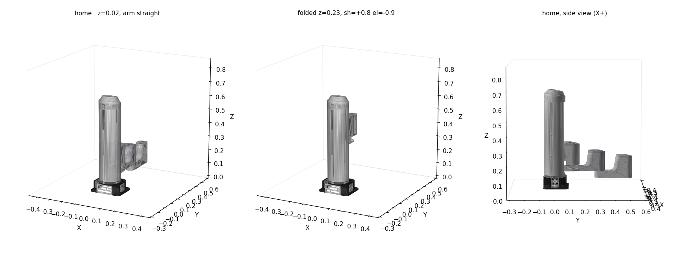

# dobot_cobot_gazebo_twin

Gazebo Harmonic digital twin of a two-robot semiconductor wafer-handling cell.
Project brief, scope contract and hardware inventory live in
[`PROJECT_CONTEXT.md`](PROJECT_CONTEXT.md).

**ROS 2 Jazzy · Gazebo Harmonic (gz-sim 8.11.0) · Ubuntu 24.04**

---

## Status

| Phase | Item | State |
|---|---|---|
| 1.1 | colcon workspace + package layout | ✅ done |
| 1.2 | Dobot M1 Pro model — real CAD meshes, P+3R chain | ✅ done |
| 1.3 | Spawns in Gazebo, anchored to bench | ✅ verified |
| 1.3 | ros2_control brings up, all 4 joints track commands | ✅ verified |
| 1.x | myCobot Pro 600 — official Elephant Robotics model (BSD) | ✅ verified |
| 1.4 | M1 Pro swapped to official Dobot model (MIT) | ✅ verified |
| 1.5 | Cell world: board, conveyor, 2 towers, belt holder, wafer | ✅ verified |
| 1.6 | Both arms + belt in ONE world, 11 joints under one controller manager | ✅ verified |

> 🟡 **The cell LAYOUT is an interim, photo-derived estimate (±20 mm)** applied
> 2026-09-03 on the owner's instruction. Nest opening directions and the
> conveyor's end/centreline come from the rectified overhead photo; both base
> yaws and both rest poses are still unmeasured. Read `CLAUDE.md` and
> [`PROJECT_CONTEXT.md`](PROJECT_CONTEXT.md) §14 before changing any pose;
> every pose lives in `src/wafer_cell_bringup/scripts/cell_layout.py`.
> [`HANDOVER.md`](HANDOVER.md) has the asset inventory. The table above tracks
> *mechanism* — that it builds, spawns and moves — not layout fidelity.

**Phase 1 is complete.** Verified end to end on 2026-09-01: both controllers
reach `active`, and `m1pro_wiggle.py` drives every joint to its commanded
waypoint and back home with no tolerance violations.

```
t= 9s  j1=+0.715  j2=-0.805  j3=-0.000  j4=+0.000
t=13s  j1=+0.800  j2=-0.900  j3=-0.200  j4=+0.075   <- full Z plunge
t=16s  j1=+0.800  j2=-0.900  j3=-0.190  j4=+1.570   <- flange roll
t=23s  j1=-0.778  j2=+0.875  j3=-0.000  j4=+0.000   <- opposite swing
t=27s  j1=-0.000  j2=+0.000  j3=-0.000  j4=+0.000   <- home
```

---

## Packages

```
src/
├── dobot_m1pro_description/     M1 Pro placeholder model + controller config
│   ├── urdf/dobot_m1pro.urdf.xacro
│   ├── urdf/inertial_macros.xacro
│   ├── config/m1pro_controllers.yaml
│   └── rviz/m1pro.rviz
├── mycobot_pro600_description/  (scaffold only)
└── wafer_cell_bringup/          worlds, launch, sequencer
    ├── worlds/wafer_cell.sdf
    ├── launch/m1pro_gazebo.launch.py
    └── scripts/m1pro_wiggle.py
```

## Build & run

```bash
cd ~/dobot_cobot_gazebo_twin
source /opt/ros/jazzy/setup.bash      # ONLY jazzy - never kilted or rolling
colcon build --symlink-install
source install/setup.bash
```

```bash
ros2 launch wafer_cell_bringup m1pro_gazebo.launch.py
```

Then, in a second sourced terminal, drive the joints:

```bash
ros2 run wafer_cell_bringup m1pro_wiggle.py
```

### Launch arguments

| Arg | Default | Meaning |
|---|---|---|
| `gui` | `true` | `false` runs Gazebo headless (`-s`) |
| `rviz` | `false` | also start RViz2 |
| `world` | `wafer_cell.sdf` | path to an alternative SDF world |

### Useful xacro arguments

| Arg | Default | Meaning |
|---|---|---|
| `prefix` | `m1pro_` | joint/link namespace, so two robots can coexist |
| `fix_to_world` | `true` | bolt the base down; `false` = free-floating |
| `use_gz_control` | `true` | `false` emits a plain URDF with no ros2_control / gz plugin — use for RViz-only viewing or to isolate spawn problems |

---

## Operational gotchas

### `gz sim` survives a killed `ros2 launch`

Ctrl-C on the launch usually cleans up, but a killed or crashed launch leaves an
orphan `gz-sim-server` (plus its `ruby` wrapper) running. Those orphans keep
their own `controller_manager` on the DDS graph, so the *next* run's spawners
talk to the stale sim and fail with `Controller already loaded, skipping
load_controller` / `Failed to configure controller`. Check and clean:

```bash
ps -eo pid,comm | grep -E "gz-sim|ruby"
```

Kill them with `pkill -9 -x gz-sim-server`. **Do not use `pkill -f "gz sim"`** —
the pattern matches the cmdline of the very shell running it, so the shell kills
itself.

### Stale `ros2` daemon hides the whole graph

If `ros2 topic list` shows only `/parameter_events` and `/rosout` while
`ros2 topic hz /joint_states` happily reports 200 Hz, the daemon is caching a
dead graph:

```bash
ros2 daemon stop
```

### Spawner timeouts

`gz_ros2_control` runs `controller_manager` *inside* the `gz sim` process, so the
CM service appears well before the sim can answer it. At the default 10 s the
spawner's call times out mid-flight and the retry double-loads the controller.
The launch file therefore passes `--controller-manager-timeout 60`,
`--service-call-timeout 60`, `--switch-timeout 60`, and delays the first spawner
5 s past model spawn.

### RESOLVED: `controller_manager` / `diagnostic_updater` ABI skew

`gz sim` was dying at exit code 127 with
`libcontroller_manager.so: undefined symbol: ...diagnostic_updater7UpdaterC1E...dh`.
`ros-jazzy-controller-manager` 4.45.2 (June 2026 sync) wanted an `Updater`
constructor ending `(..., double, unsigned char)`; the installed
`ros-jazzy-diagnostic-updater` 4.2.6 (April 2026 sync) exported only
`(..., double)`. Fixed by upgrading to 4.2.7:

```bash
sudo apt install --only-upgrade ros-jazzy-diagnostic-updater ros-jazzy-diagnostic-msgs
```

A plain apt batch skew — unrelated to Jazzy-vs-Humble middleware or gz-sim8/9.

---

## The M1 Pro model

`urdf/dobot_m1pro.urdf.xacro` uses **real Dobot CAD geometry** — STL meshes
triangulated from Dobot's published `M1-Volume_V6-180427.stp`. See
[`src/dobot_m1pro_description/ATTRIBUTION.md`](src/dobot_m1pro_description/ATTRIBUTION.md)
for provenance and an **unresolved GPLv2 question** that matters only if this
project is ever distributed.



### The kinematics are not textbook SCARA

The first placeholder assumed `2 revolute + 1 prismatic + 1 revolute` with a
ball-screw spline at the wrist — the layout PROJECT_CONTEXT section 5 describes.
**That is wrong for the M1 Pro.** The vertical axis is the *first* joint: the
whole arm assembly rides a carriage up and down the column, and there is no
spline at the wrist.

```
base -> stand -> [PRISMATIC Z] -> [REV] -> [REV] -> [REV]
```

Confirmed independently by Dobot's CAD assembly and by the linear rail visible
on the column in `docs/reference_photos/20260826_191040.jpg`.

Dobot's axis labels do **not** match chain order — map through this table when
mirroring PLC or real-robot commands in Phase 4:

| chain position | model joint | Dobot label |
|---|---|---|
| 1 (prismatic) | `m1pro_z_lift` | J3 (Z) |
| 2 (revolute) | `m1pro_shoulder` | J1 |
| 3 (revolute) | `m1pro_elbow` | J2 |
| 4 (revolute) | `m1pro_wrist` | J4 |

Verified against the datasheet: L1 = L2 = 200 mm → 400 mm reach; column
687.6 mm; ±85° / ±135° joint limits; ~210 mm Z stroke.

### ⚠️ Never initialise a joint at its limit

`initial_value` for `m1pro_z_lift` must sit strictly **inside** its range.
Initialising at exactly `z_lower` (0.02) made the joint report
`0.0199999999999902` — a hair outside its own limit — after which it **ignored
every command for the entire run** while the other three joints tracked
normally. It looks exactly like a dead actuator or a bad effort limit; it is
neither. Started interior, the axis moves freely and reaches and holds 0.020 at
runtime without complaint. Only *initialisation* at a limit latches it.

---

## ⚠️ Model fidelity warning

Every dimension in `dobot_m1pro.urdf.xacro` is a placeholder sized from
best-known catalogue figures (400 mm reach, 250 mm Z stroke, ±85°/±135° joint
limits). The **kinematic structure is correct**; the **numbers are not
authoritative**. Do not quote reach or workspace figures from this model until
spec-sheet values replace them.

**This section now applies only to masses and inertias.** Link geometry, joint
origins, axes and limits all come from Dobot's CAD and are trustworthy.

The meshes carry no mass data, so link masses are apportioned to sum to the
M1 Pro's ~41 kg published weight, and inertias are solid-box approximations of
each link's bounding box. That is fine for position-controlled pick-and-place
but **not** valid for dynamics, payload or torque studies.

The TCP frame sits at the J4 output face, which sweeps **67 mm to 277 mm above
the robot's base plate**. With the base on the bench at z = 0.75 m, that is the
usable pick envelope — the wafer nest height in Phase 3 has to land inside it.

The previous primitive model is kept at
`urdf/dobot_m1pro_placeholder.urdf.xacro.bak` as a fallback, since this
workspace is not under version control yet.
